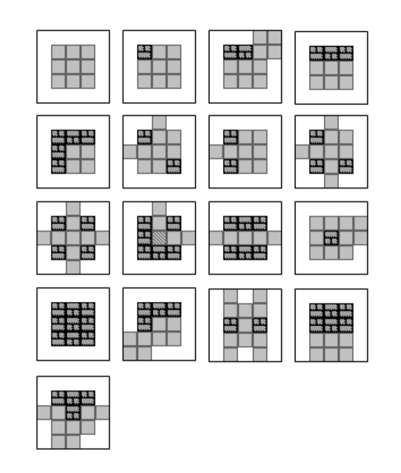

# ProceduralSokoban
## Abstract

This project is a procedural level generator for Sokoban game. It's written in C#. This project was made for Master 2 school project. With this project you can generate level for the Sokoban game. The scientific paper of Joshua Taylor and Ian Parberry entitled "Procedural Generation of Sokoban Levels" help us to create our algorithm. 

## Installation
### Windows

You just need to download .NET SDK and .NET runtime ([here](https://docs.microsoft.com/fr-fr/dotnet/core/install/windows?tabs=net50))

### MacOS

Download and install .NET SDK ([here](https://dotnet.microsoft.com/download))

### Linux

Run these commands to install .NET on Ubuntu 20.04

#### Add Microsoft Package Signature
```
wget https://packages.microsoft.com/config/ubuntu/20.04/packages-microsoft-prod.deb -O packages-microsoft-prod.deb
sudo dpkg -i packages-microsoft-prod.deb
```

#### Install SDK and runtime
```
sudo apt-get update; \
  sudo apt-get install -y apt-transport-https && \
  sudo apt-get update && \
  sudo apt-get install -y dotnet-sdk-5.0 \
  sudo apt-get install -y aspnetcore-runtime-5.0

```

## How does it works ?

This is the differents steps of the algorithm :
- Create a 2D array of empty Cell
- Place random templates randomly oriented in the grid
- Optimize level generation
- Place crates
- Place goals
- Place player

### Templates

This is the list of template we use ([source](http://ianparberry.com/techreports/LARC-2011-01.pdf)) :



A template is a level part corresponding to a 3x3 grid. To create the level, first we pick a random template in this list. Then we apply a random rotation and we place it in the grid. We repeat this step to fill all the grid. During the placement we use the cell around the template to make sure they are correctly side placed. When this step is finished, we begin the level optmizitation.

### Level optimization

After the templates placement, differents issue in the generation can appears. Actually, the optomization part clean differents things :
- Clean dead cells
- Clean useless rooms
- Clean alone walls (wall surrounded by 7 floor or more)

First we replace dead cells by walls to avoid long one width corridor for example. Then we search the biggest room in the level, and we fill by walls all other rooms. Finally, we remove some alone walls to avoid cheese effect (a lot of alone walls inside the level).

### Crates placement

Before placing crates, we need to detect dead cells in the grid. Dead cell means : Cell where the crates can't move outside when they enter it. When all dead cells are detected, we choose some random floor cell to place crates inside. 

### Goals placement

The goals inside the level are actually randomly place. We know that it can be improve to increase the quality (difficulty) of the level.

### Player placement

Like the goals, the player is actually randomly place. We think that we can improve variety of level by changing the placement strategy. These points are actually listed in the "Improvements Part"

## Results

You can just print the generated level in the terminal or you can export multiple generated level with the `export()` function

## Test

You can test generated level with JSoko ([link](https://www.sokoban-online.de/)). You just have to copy the generated level and import it in JSoko. We use the level format of JSoko, so there is no compatibilty issue.

## Unity

We have made an implementation of the project in Unity. You find the associated repository ([here]()) and you can download differents builds ([here](https://tlecouffe.itch.io/sokoban-map-generator)). We chose Unity because we wanted improve our skills on that software.

## Improvements

List of improvement for this project :
- Dead Cell detection
- Improve goal placement strategy
- Improve player placement strategy
- Automatic test for generate level (create metrics, then report)
- Clean useless wall around level

## Sources

- http://ianparberry.com/techreports/LARC-2011-01.pdf
- http://ianparberry.com/research/sokoban/

